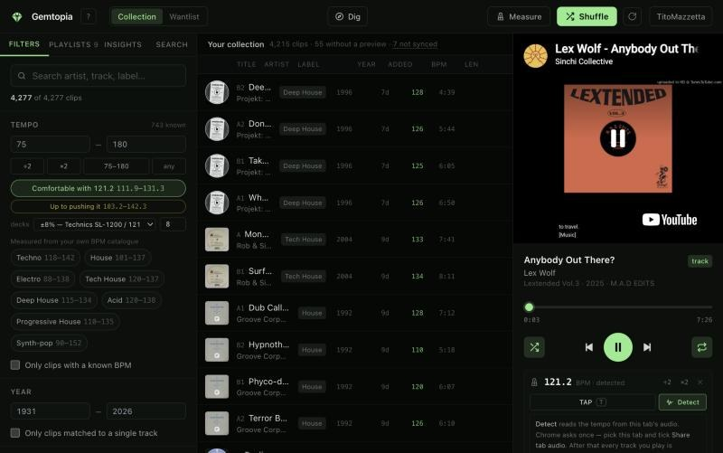
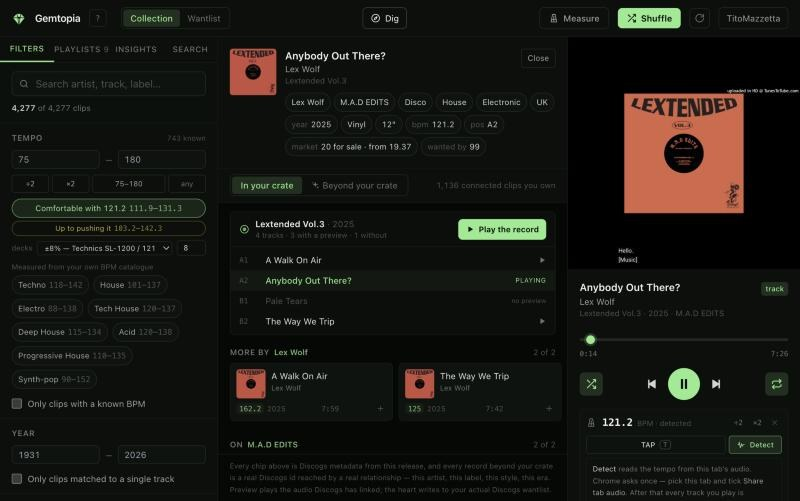
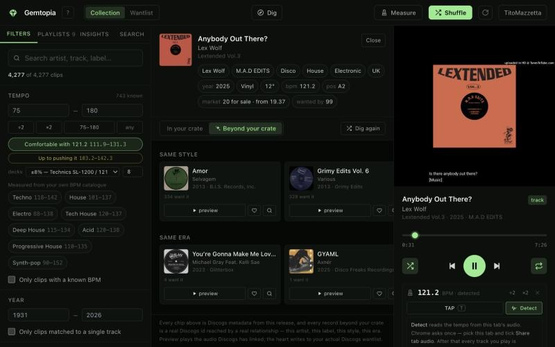
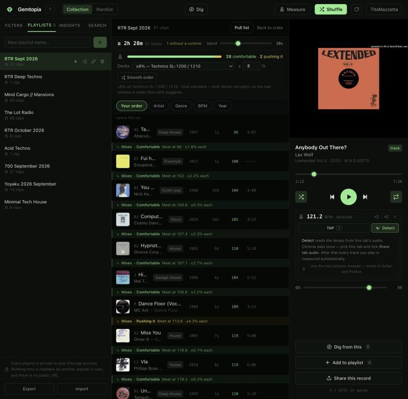
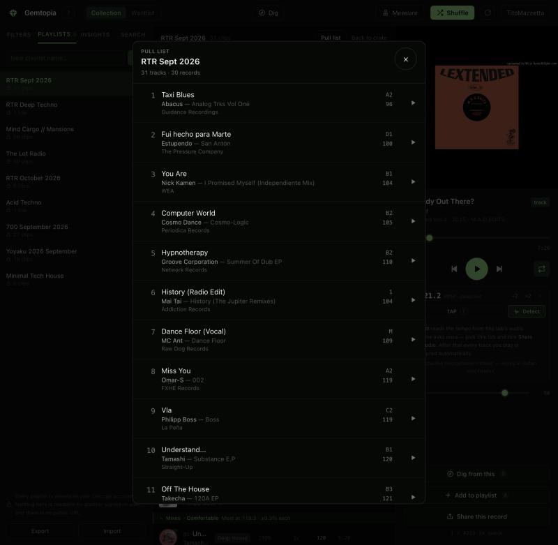
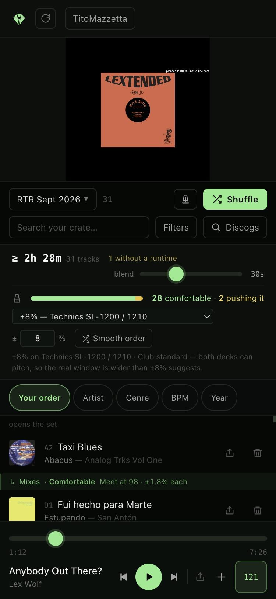
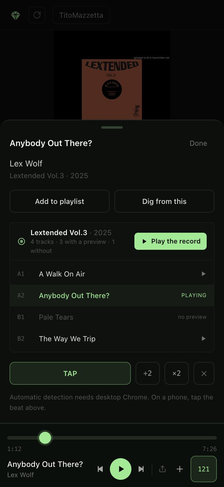

<div align="center">

<picture>
  <source media="(prefers-color-scheme: dark)" srcset=".github/mark-dark.svg">
  
</picture>

# Gemtopia

**For the storytelling DJ.**

Dig your records, shape the set, tell the story. Built by a DJ who loves records.

[gemtopia.vercel.app](https://gemtopia.vercel.app) · sign in with your Discogs account

[](https://github.com/titomazzetta/gemtopia/actions/workflows/ci.yml)
[](./THREAT_MODEL.md)
[](./LICENSE)

<br>



</div>

---

## Who this is for

**Vinyl DJs, away from the decks.**

I play records, and the problem I kept having is that the crate is the instrument —
you can only really play it standing in front of it. Everywhere else your
collection is just an inventory: a list of things you own and can't hear. Meanwhile
the useful thinking always happens exactly where the records aren't. On a train. In
a hotel the night before. Three weeks out from a gig, when you know roughly what
you want the set to feel like and can't audition a single record to find it.

So I built the thing I wanted. Gemtopia turns your Discogs collection into
something you can **hear, sort, sequence and argue with from your phone** — so the
set is half-built before you get home, and pulling the records is twenty minutes of
picking instead of an evening of rediscovery.

A few things I use it for constantly:

### Prep a set on the road

Shuffle your own records and actually listen. Cut the crate to a style, a label, a
decade, a tempo. Build the playlist as you go. Tap the BPMs in while they play —
and get told, before you pack the bag, whether the records in that order will
**actually beatmatch on your decks**, at your pitch range, with the exact fader
move each transition needs.

### Fall down a hole from a record you already own

This is the part that surprised me. When you're going through your own collection,
you keep bumping into a record and thinking *"I want more of this."* Normally that
thought dies there, because you're not near a shop and you can't remember the
label.

Press `D` and it doesn't die. You get everything else **you already own** that
connects to that record — same artist, same label, same style, same year, same
mixable tempo — instantly, no network. And then, one click further, **everything
that exists beyond your collection**: other versions of that very record, whatever
its remixer or producer made, the rest of that artist's discography, the rest of
that label's catalogue, records from the same scene and the same three years.
Preview the audio without owning them. Heart the ones you want. Dig again from
*those*, and keep going — no lane ever just stops.

So a collection stops being a closed box. **The records you own become the map for
finding the ones you don't** — which is what digging in a shop feels like, and what
browsing a database usually doesn't.

### Write the set list from the shelf

Most of a vinyl collection has no clip on YouTube — not every track, not every
record. Those tracks are still here, straight off the Discogs tracklist, marked
*record only*. Put the record on, tap the tempo in, and drop the track into the
set next to the ones you can preview. The set list is written while you listen
to the actual records.

### Build a back-to-back

Share a playlist with the DJ you're playing with. You both add records, you both
reorder, each row says whose crate it comes out of, and the chat keeps the
conversation next to the set — what opens, which blend needs work, who's bringing
what.

---

It runs on the Discogs API, it's meant to be used on trains and in hotel rooms,
and I wrote it to be read as well as run. If you're here for the code rather than
the records, the [threat model](./THREAT_MODEL.md) is the part I'd point at
first — it says what's defended, how, and what deliberately isn't.

---

## What it's built around

A few ideas every feature is held to. They're why the app looks the way it does.

- **Does it help a DJ tell a story?** That's the filter for what gets built.
  Other DJ tools are built around the mix; this one is built around the set, and
  what it says.
- **Your order is the set.** A playlist's hand-built order is never rewritten
  behind your back. Sorting a playlist is a lens you look through; reordering it
  is always your move, and it can be undone.
- **Every result says why.** Nothing is "recommended". Each record in a dig is a
  real Discogs release reached by a relationship named on its card — this
  remixer, this label, this year.
- **Nothing is hidden.** Records with no audio, tracks with no preview, releases
  that haven't synced — all shown, dimmed and labelled, never silently missing.
- **No dead ends.** Every lane ends in *more*, *deeper*, or where to go next. On
  a phone as much as a laptop.
- **Words, not just colours.** Green and amber are nearly identical to a
  colour-blind eye, so every coloured state also says what it means.
- **Clean over clever.** New ideas go into the screens that already exist — a
  lane in Dig, an item in a menu — rather than new tabs and panels.
- **Secure enough to show.** Least privilege, one documented exception, and a
  threat model that says what isn't defended as plainly as what is.

---

## See it

<table>
<tr>
<td width="50%"></td>
<td width="50%"></td>
</tr>
<tr>
<td><sub><b>Dig from anything.</b> The whole EP, and everything you own that connects to it.</sub></td>
<td><sub><b>Beyond your crate.</b> Same style, same era, same remixers — with previews.</sub></td>
</tr>
<tr>
<td></td>
<td></td>
</tr>
<tr>
<td><sub><b>Will it mix?</b> Every transition checked against your decks' pitch range.</sub></td>
<td><sub><b>Whole list.</b> Every record, every transition — audition, reorder, tick off as you pull.</sub></td>
</tr>
</table>

<p align="center">

&nbsp;&nbsp;

</p>

### Install it as an app

It installs like an app — its own window, its own icon, no browser bar:

- **Chrome or Edge** (Mac, Windows, Linux): the **Install Gemtopia** button at
  the right of the address bar.
- **Safari on a Mac:** File → **Add to Dock**.
- **iPhone or iPad:** Safari → Share → **Add to Home Screen**. Sign in from the
  installed app itself — iOS keeps a home-screen app's sign-in separate from
  Safari's.
- **Android:** Chrome → ⋮ → **Install app**.

There's nothing to download or update: it is always the live version.

---

## Contents

- [Who this is for](#who-this-is-for)
- [See it](#see-it) · [Install it as an app](#install-it-as-an-app)
- [What it's built around](#what-its-built-around)
- [What it does](#what-it-does)
- [The digging model](#the-digging-model)
- [BPM, and how it actually works](#bpm-and-how-it-actually-works)
- [Set prep: will these records actually mix?](#set-prep-will-these-records-actually-mix)
- [Where the data comes from](#where-the-data-comes-from)
- [Privacy](#privacy)
- [Deploy it](#deploy-it) — full walkthrough in [DEPLOYING.md](./DEPLOYING.md)
- [How a change reaches production](#how-a-change-reaches-production) — branch rules, CI gates, supply chain
- [Tech stack](#tech-stack)
- [Architecture](#architecture)
- [Testing](#testing)
- [Known limits](#known-limits)

---

## What it does

| | |
|---|---|
| **Shuffle the crate** | Fisher–Yates over every clip Discogs has for your collection, spread so the same release never lands twice in a row. |
| **Filter on real metadata** | Style, genre, label, artist, format, country, decade, year and tempo — every option counted from *your* synced collection. Multi-select is **any** or **all**, so you can ask for Techno *or* Deep House, or for the shelf tagged both. |
| **Works on a phone** | Sheets rather than stacked panels: source and playlists in one, filters in another, the player in a third. Transport and TAP sit in a sticky bottom bar at thumb height. Tap the playing track and the whole record opens above that bar — so the scrubber, previous and next stay under your thumb while you flip through the EP. Dig is one scroll with the crate/beyond switch pinned. |
| **Sort the crate** | Click a column: title, artist, label, year, BPM, length. Ascending, descending, then back to shuffle order. Unmeasured tempos always sink, in both directions. |
| **Hear the whole record** | Something grabs you on shuffle: tap the artist or the record and the whole release opens in running order — every track, the one playing marked, the ones with no audio still listed. Play it through, then drop straight back into your shuffle where you left it. |
| **Dig from anything** | Hit `D` (or **Dig from this** on a phone) on whatever's playing and pivot on any field. Two halves: what else you own, and what exists beyond it — other versions, the remixer or producer, the artist, the label, the style and the era. No lane dead-ends: each one ends in **More** or **Dig deeper**. |
| **Playlists that follow you** | Stored against your Discogs account. Private by default, always. On a desktop, drag any record from the crate or a dig lane straight onto a playlist (hover the Playlists tab and it opens); on a phone it's the + button. Drag to reorder, play in order or shuffled. **Whole list** opens the entire running order at once. **Compact** is one line per record — BPM, and a chip with the pitch the move into it needs, coloured by how comfortable it is — so a phone shows a dozen at a time; **Detailed** adds the full transition strip between every pair, the release and the label. Tap a record to hear it (the list stays open, with the player bar under it), press and hold a record — or drag its grip — to move it, tap its number to tick it off as it goes in the bag. On a phone the playlist screen keeps to one row of controls and a one-line set-prep summary that opens with a tap, so the records get the space. View by artist, genre, BPM or year without losing the order you built. |
| **BPM catalogue** | Detect tempo from the audio as it plays — with a live beat meter showing exactly what it hears — or tap it in with `T`. Genre-aware: a record Discogs tags as drum & bass is counted at 174, not 87. **Measure** plays through everything on screen unattended, skipping what is already done. |
| **Share a set** | One tap mints a read-only link to a playlist that anyone can open and play — no account, no route back to yours. Turn sharing off and the link is dead, not dormant. See [the one exception](#the-one-exception-and-why-it-looks-like-one). |
| **Set prep** | Every transition in a playlist checked against your decks' pitch range, in three tiers: **comfortable**, **pushing it**, or **out of range**. Flags the hard ones before you pack the bag. |
| **Share a find** | A share icon on every row and in the player. Sends the Discogs release page — not a Gemtopia link — because the friend you're sending it to probably doesn't have an account here. Native share sheet on a phone, clipboard on desktop. |
| **Wantlist, both ways** | Shuffle your wantlist like a crate, and add to it from anywhere in the app — it writes to your real Discogs wantlist. Anything playing that you don't own (a dig preview, a search preview, a friend's record on a shared set) gets a **heart right on the player**, the phone bar included, or press **W**. |
| **Search Discogs and add** | The record arrived in the post: search by artist, title, **track name**, catalogue number or barcode, and put it in your collection or wantlist without leaving the app. Every result says whether you already own it. **Tap a record you own and it plays** — from the track you searched for, if you searched by track — with its tracklist open to jump around; open any other result to preview its tracks. What you add is playable immediately, not after the next sync. |
| **Newest first, by default** | Your collection and wantlist both open in the order you added to them, newest at the top — the same way Discogs presents them. No button to press and nothing to keep in sync: the dates come off the collection and wantlist endpoints, which we already read. Sortable both ways as an **Added** column. |
| **Record-only tracks** | Most vinyl has no YouTube clip for every track. Those tracks are listed from the Discogs tracklist anyway — a disc on the artwork, a *record only* tag, side and length. Tap one for a tap pad: put the record on, tap along, and its BPM is in your catalogue. Add it to a playlist like any other track, so you can **write the set list from the shelf** while listening to the real records. The player and shuffle skip them. |
| **Build a set together (B2B)** | Turn any playlist into a shared one with a join link — anyone with a Gemtopia account presses **Join**. Everyone adds and reorders; you take out only what you added, and the owner has the last word. Shared playlists are edged in amber, and every row says who brought the record. A **chat** on every shared playlist, Telegram-style, with small notes when the set changes — *komron added Shiva — Kerri Chandler · 1998 · 124 BPM* — and an unread count, like a messenger, on the chat button, on the playlist and by the logo — the same on your phone and laptop. A tempo anyone logs becomes the set's BPM for everyone on it. |
| **Install it as an app** | Add to Home Screen on an iPhone, **Install** in Chrome or Edge, **Add to Dock** in Safari on a Mac. Full screen, its own icon, safe-area aware on iPhones. |
| **Invite-only** | New accounts need a one-time code from an admin — an hour or a day, single use. Everyone already in keeps their access. |
| **Nothing is hidden from you** | Records with no preview on Discogs still appear in the crate, marked, instead of silently not existing — track by track where Discogs has a tracklist. On a first sync every record shows up within a minute as *loading* — tap one and it's fetched next. The header splits the count: what plays, what's record only, what Discogs has no audio for, what's still loading, and what hasn't finished syncing — the last of which is a button. |
| **Shown how, not left to guess** | A four-card welcome on your first visit — what it is, how to hear it, how to build a set, digging and B2B — worded for the device you're on (drag on a desktop, + on a phone). After that, **?** (or the ? button, phones included) opens *How it works*: every feature in a few lines, the keyboard shortcuts, and the tour again. |
| **Out of the way when it's routine** | The check for new records that runs on every visit is a thin line at the top, not a banner over a crate you can already use — and when it lands it says so: *3 new records in your collection*. The full banner, with an honest time estimate, is kept for a first sync or a big haul. Before anything plays, the player offers **Shuffle** and the playlists you used last instead of an empty box. On a laptop-sized window the crate drops the style, year and added columns so titles stay readable. |
| **Playlist dissection** | What a playlist is made of, and what to dig for next, from Discogs' artist and label graph. |

### Keyboard

| Key | Action | | Key | Action |
|---|---|---|---|---|
| <kbd>Space</kbd> | Play / pause | | <kbd>T</kbd> | Tap tempo |
| <kbd>←</kbd> <kbd>→</kbd> | Previous / next | | <kbd>D</kbd> | Dig from this record |
| <kbd>J</kbd> <kbd>L</kbd> | Back / forward 10s | | <kbd>A</kbd> | Add to a playlist |
| <kbd>S</kbd> | Shuffle what's on screen | | <kbd>B</kbd> | Back to shuffle, after exploring a record |
| <kbd>R</kbd> | Repeat | | <kbd>/</kbd> | Search |
| <kbd>W</kbd> | Wantlist heart, for a record you don't own | | <kbd>?</kbd> | How it works, and every shortcut |
| <kbd>Esc</kbd> | Close | | | |

---

## The digging model

The hierarchy is deliberate. **Playlist-building from your collection is the
primary job** — that's the main list, the shuffle button, and `A`. Digging is what
happens when something surprises you mid-shuffle, and it never takes over the
screen you were working in.

Press <kbd>D</kbd> on any playing track and you get the record's full Discogs
metadata, with **every field as a pivot** — artist, label, style, genre, country,
year, format, catalogue position, BPM, and how many people have and want it.
Click any of them to re-cut the crate by that value.

Below that comes the whole record in running order — every track, the one
playing highlighted, ▶ on the ones with a preview and "no preview" on the rest —
and then two halves that differ on purpose:

### In your crate — instant, no network

Everything you already own that connects to this record:

```
More by      Moodymann
On           Peacefrog
More         Deep House
From         1996–2000
Mixes with   124 BPM        ← includes half- and double-time matches
Pressed in   US
```

All of it computed from the local IndexedDB cache, so it appears the moment you
press the key. Click anything to play it; `+` adds it to a playlist. Each lane
shows the first 16 and ends in **More**, then **Beyond your crate →** once it
has shown everything you own there.

### Beyond your crate — seven Discogs lanes

Records you *don't* own, each tagged with the relationship that surfaced it:

| Lane | How it's found |
|---|---|
| **Other versions** | Every other pressing of the same master — remix packages, promos, represses |
| **Credits · *name*, remixer** | The first credit worth following (remixer, then producer, then writer) — their own records *and* what they remixed or produced for others |
| **More by this artist** | The artist's discography, minus what you own |
| **More on this label** | The label's catalogue |
| **On *label* · where *artist* has released** | Another label the artist has put records out on, read through records by *anyone* — the artist's world, and the next name to follow. **Dig deeper** moves to their next label |
| **Same style** | Discogs search on the style, ranked by how many people want it |
| **Same era** | Style + a ±3 year window + country of pressing |

Credits skip the roles that don't shape the music — mastering, lacquer cut,
artwork, photography — and never repeat the record's own artist. Digging from
a record you found beyond the crate gets every lane too: its artists and labels
are looked up by id first, so it isn't limited to style and era. A dig is at
most eight Discogs calls, and the per-user limit (7 a minute) keeps even a
fast digger under Discogs' 60-a-minute budget.

Each result gives you three things: **preview** (plays the audio Discogs has
linked, without owning the record), **♡** (writes to your actual Discogs
wantlist), and **⌕** (re-seeds the dig from *that* record).

That last one is what makes it endless. Dig from a record you don't own, land on
another, dig again. **"Dig again"** re-runs the same seed while excluding
everything you've already been shown, so the feed always moves.

No lane just stops. Every lane ends in a tile: in your crate it's **More**
(then **Beyond your crate →** once it has shown everything you own there);
beyond it's **Dig deeper →**, which reads the next page of the same four
lookups and adds it to the lanes you're already looking at. When Discogs has
nothing further for that seed, the lane says so and points at ⌕.

On a phone, tap the track in the player bar and the whole record is right
there under it — tap any track on the EP to hear it, and **← Back to shuffle**
returns you to the track after the one you left.

### Why not a black-box recommender

Spotify's radio is a learned embedding — it works, and it can't tell you why.
Gemtopia goes the other way: every result is a real Discogs release ID reached
by a relationship you can see named on the card. When you're deciding whether to
spend £30 on a record, "because Moodymann released it on Peacefrog in 1997" is a
better answer than "listeners like you also enjoyed".

The playlist-level analysis (a separate, slower feature) optionally adds a Claude
pass to rank and explain those candidates — but it can only reorder what the
graph found. Any release ID the model invents is discarded before it renders. A
catalogue number you walk into a shop with has to exist.

### The records that were never there

The crate is built from the YouTube links Discogs holds against a release, so
for most of this app's life a record with no links produced no rows — and a
row that does not exist looks exactly like a record you do not own. You could
buy it, sync it successfully, see it on Discogs, and never once find it here.
There was a test asserting that behaviour, which is the uncomfortable part: it
was deliberate, and it was wrong.

They now appear. **A record with a tracklist but no clips shows every track,
"record only"** — and so does any track YouTube doesn't cover on a record that
has some clips (an EP with a clip of A1 also lists A2, B1 and B2, unless a
side-long rip already covers the record). They carry a disc on the artwork and
a *record only* tag, their side and length from the tracklist, and a key of
their own (`123456:t.B2`), so they can go in a playlist and carry a BPM like
any track. The player and shuffle skip them; tapping one opens its side,
length and a tap pad, so you can put the record on in the room and log the
tempo. That's how a set list gets written from the shelf.

What's left is two kinds of silence, **never reported as each other**, because
they lead somewhere different:

- **No preview** — Discogs holds no audio *and* no tracklist for this pressing.
  Permanent, and there is nothing to do about it.
- **Not synced** — the sync never fetched the release, so we do not actually
  know whether it has audio. One refresh away from being fixed, which is why
  that count in the header is a button.

`market` is what tells them apart: a real `/releases/{id}` fetch always returns
`num_for_sale` and `lowest_price`, so a null market can only be a placeholder
the sync wrote without ever reaching the release. Calling that "Discogs has no
audio" would be a confident wrong answer about a record you can play on Discogs
right now.

`Playable.videoId` is `string | null` rather than an empty-string sentinel,
specifically so the compiler finds every consumer that assumed a video exists.
It found four. Silent records are filtered at `playFrom`, the single door into
the queue, and `queueFrom` re-derives the index rather than reusing it — row 40
on screen is not row 40 in the queue once rows are dropped.

### The record that just arrived

Everything above works on records you already own. This is the one place the
app looks outward, and it exists because of a gap in the loop it otherwise
closes: records turn up in the post, and adding one meant leaving for
discogs.com, searching a site that is unkind on a phone, and coming back.

**The second line of each result is the whole feature.** Search "Untitled" on
Discogs and you get twelve pressings that look identical until you open each
one. You are not looking for *a* pressing of this record — you are looking for
the one in your hand. Year, catalogue number, label, country and format on one
truncated monospace line answers that without a tap, and every row stays the
same height so the list is scannable rather than readable.

**Four fields, chosen rather than guessed.** `q` is a fuzzy match over artist
and release title and **does not look at tracklists**, so searching a track
name used to return nothing whenever that name was not also the release title —
which for a 12" of untitled cuts is always. Discogs exposes `track` for exactly
this, and `catno` and `barcode` are exact-match fields where a value typed into
`q` would just be noise. Inferring the field from the shape of the input was the
alternative; plenty of real record titles look like catalogue numbers, and a
search that quietly ran a different query than you asked for is worse than a tap.

Searching is explicit — submit, not debounced-as-you-type. Discogs allows 60
authenticated requests a minute for the whole account, shared with a collection
sync that may be running in another tab. A request per keystroke would race the
thing that makes the app usable at all.

**Opening a result costs one request, and buys the one fact the list cannot
have.** The search response carries no video links, so until a release is
fetched there is no honest way to say whether it has anything to play.
Expanding a row fetches it once and shows the tracklist, copies for sale, the
green in-collection tick, and whether any previews exist. If that fetch fails
it says the release could not be loaded — not "no previews", which would be a
claim about the record invented out of a failure of ours.

**Adding to your collection asks first; the heart doesn't.** That asymmetry is
the whole argument. The wantlist is a toggle — press the heart again and the
record leaves — so a confirmation there would be friction with nothing behind
it. A collection add has no undo anywhere in this app, on purpose, so a mis-tap
on a phone can only be fixed by opening Discogs on something else. The
confirmation isn't friction; it's the only safety net that exists.

It's an inline strip rather than a dialog, because the disambiguation line sits
three pixels above it and that line is the thing being confirmed — a modal
covering the row would hide the evidence. And if you already own the record it
says so, since Discogs models a collection as instances and a second copy is
legal but rarely intended.

**Adding makes it playable now.** A collection sync walks everything you own
and takes about ten minutes on a large collection — fine as a background
top-up, useless when you are stood at the decks with the record in your hand.
So the add path fetches that one release and writes it exactly where a sync
would have: the summary index and the detail cache. Nothing downstream has a
special case for it.

Two honesty constraints fell out of that, both in `client/adopt.ts`:

- A crate is built from the YouTube links Discogs holds against a release, so a
  pressing with no links is a record you now own that will **never** appear in
  the list. Saying "added to your collection" next to a crate that did not
  change is how people end up pressing the button twice. The message names
  which of the two things happened.
- The add and the detail fetch are two calls, and only the first changes
  anything on Discogs. If the POST lands and the fetch then fails, the record
  *is* in your collection, and the message must not read like nothing happened.

### What's not built

**Reddit mining** — deferred by choice. It needs its own OAuth app, costs money
above the free tier, and returns unstructured comment text that would need an LLM
pass *and* a Discogs verification pass to be trustworthy. The dig engine is
structured so an adapter can drop in later without a rewrite.

**Identifying a record from a photo** — deferred, not abandoned. Discogs has no
image search endpoint, so this would mean a vision model reading the label and
then a Discogs lookup on what it read. The lookup half is what shipped here;
`catno` and `barcode` are already plumbed through the search route as exact-match
parameters, which is precisely what a photo of a label or a sleeve barcode would
produce. The remaining question is who pays for the vision call, and that is a
product question rather than a technical one.

**Discogs Lists** — only partly possible. The website shows, on every release,
the user lists that include it; the API has no such lookup (only one user's
lists, or one list by id), and Discogs' Terms forbid scraping the site, so
"lists this record is on" can't be a dig lane. The API also can't *create* a
list, so a playlist can't be written back as one. What would work, and may come
later: a lane from your own lists, and following any public list by its link.

**Browsing stores with recent finds** — not possible. The Discogs API exposes no
way to enumerate sellers or their recent stock. What it *does* expose is per
release: how many copies are for sale and the lowest asking price, both of which
Gemtopia shows with a deep link to the marketplace page.

---

## BPM, and how it actually works

The obvious approach is impossible, so it's worth saying why. The YouTube player
is a cross-origin iframe — `createMediaElementSource` needs an element from our
own document, and the IFrame API exposes no samples. You cannot reach in.

What you *can* do is capture the tab's audio **on its way to the speakers** with
`getDisplayMedia({ audio: true })`. Approve it once per session and every track
afterwards gets analysed: spectral-flux onset detection → whitening →
autocorrelation → comb filtering across four harmonics → a stability gate that
waits for the reading to hold for ~6 seconds before storing anything.

While it listens, a **beat meter** draws the onset signal the estimate is being
computed from — the same numbers, not a separate visualiser — so a steady row of
kicks means it's about to lock, and a flat line means it's guessing. A countdown
covers the eight seconds of audio it needs before the first reading, which used
to look like nothing happening at all.

Nothing is downloaded, stored, or re-transmitted. The only thing that leaves the
module is a number.

**Tap tempo** is on <kbd>T</kbd> as well as the button, and both are timed on the
press, from the input event's own timestamp — not when the finger lifts, and not
whenever JavaScript gets round to it. That variance is exactly the noise tap
tempo exists to average out.

**Three sources, with precedence enforced in SQL, not in the browser:**

```
manual / tap   ─┐
                ├─▶ always beats ─▶  auto detection ─▶ beats ─▶ text-parsed
stronger auto  ─┘                                                (from Discogs
                                                                  notes/titles)
```

The background detector can never overwrite a number you tapped in yourself.
Six test cases pin that behaviour.

**Caveats, plainly:**

- Tab audio capture is **Chromium-only** (Chrome, Edge, Brave, Arc). Firefox and
  Safari fall back to microphone capture off your speakers, or tap tempo.
- You must tick **"Share tab audio"** in the picker or no audio track arrives —
  the app will tell you.
- **Which octave is a convention, not a measurement.** A 174 BPM track with a
  half-time snare genuinely describes 87 too; the estimator hears the pulse, not
  how DJs count it. So readings fold into **70–160** by default (you can change
  it) — unless the record's Discogs styles name its genre, in which case it's
  counted the way that genre is: drum & bass at 160–180, dubstep at 135–145,
  nineteen styles in all. Tagged DnB now reads 174. **Untagged** DnB still reads
  87, and untagged dubstep reads 70 — the measured cost of a default that
  favours slow music, pinned in tests. **÷2 / ×2** settles either in one press,
  and a tap always wins.

**The tempo filter** defaults to **75–180 BPM** — wide enough for hip hop through
jungle — but the inputs accept 40–260, so nothing is fenced in. `÷2` and `×2`
scale the *whole window*, for finding half- and double-time versions of what
you're playing.

The style presets underneath aren't guesses. Once you've catalogued a few tempos,
Gemtopia computes the 10th–90th percentile of what each style actually runs at
**in your collection** and offers those as chips. Your Detroit techno might sit at
132–138; the chip will say so.

---

## Set prep: will these records actually mix?

Open a playlist and every transition is checked against the pitch range of the
decks you play on. The strip between two records tells you whether they
beatmatch, at what tempo, and how far each fader has to move:

```
  Basement Cut · Moodymann                                            124
↳ Mixes · Comfortable      Meet at 125 · ±0.8% each                    ← green
  Chrome Cut · Theo Parrish                                           126
↳ Mixes · Comfortable      Meet at 128.5 · ±1.9% each                  ← green
  Sunset Cut · Larry Heard                                            131
↳ Out of range             Needs ±15.4% — wider than your ±8%          ← red
  Nocturne Cut · Omar-S                                                96
↳ Half-time · Pushing it   Meet at 91.3 at half-time · ±4.9% each      ← amber
  Midnight Cut · Moodymann                                            174
```

**The colour says how hard the faders work; the words say how the records
meet.** ±8% is a ceiling, not a working range — records live in the middle of
the fader, and a blend run with both decks near their limits is one you hear.
So a transition is **Comfortable** (green) when neither deck passes half its
range, **Pushing it** (amber) when it fits but has to go further, and **Out of
range** (red) when it doesn't fit at all. A double-time blend at ±0.6% is
Comfortable; a straight 1:1 at ±7% each is Pushing it.

**Every colour carries its word.** Phosphor's green and amber are 1.16:1 in
luminance — without hue, close to the same colour — so for a red-green
colour-blind DJ the words are the signal. The strip, the summary bar and the
filter panel all use the same three words from one source, and a test sweeps
real tempos across four deck ranges to prove no two tiers ever read the same.

A summary bar above shows the shape of the set at a glance — *"4 comfortable ·
1 pushing it · 1 out of range"*, counted exactly the way the strip colours
them — and **Smooth order** reorders the playlist so they fit.

**Your order stays the set.** A row of chips above the list — *Your order ·
Artist · Genre · BPM · Year* — lets you look at a playlist the way rekordbox
or iTunes would, to find the Moodymann or everything over 128. A view is only
a lens: it never touches the stored order, ties keep your order, and records
with no tempo or year sink to the bottom either way. Dragging and the
transition checks live in *Your order* only, because they only mean something
between records you will actually play back to back. **Keep this order**
adopts a view when you want it as a starting point, with one step of undo —
and it is refused unless the new order holds exactly the same records, so it
can reorder a set but never drop or duplicate one.

### The maths, because it is easy to get wrong

**A pitch fader is a percentage, not a BPM offset.** ±8% on a Technics is ±7.2
BPM at 90 and ±13.9 BPM at 174. Implementing "±8" as "within 8 BPM" would be
wrong at both ends.

**Both decks have a pitch fader.** You are not obliged to hold the outgoing
record at zero and drag the incoming one to meet it — pull one up, push the
other down, meet in the middle. Two records at A and B BPM can meet if

```
A·(1 + x) = B·(1 − x)   for some pitch fraction x ≤ your range
```

which solves to `x = |B − A| / (A + B)`, and they meet at `2AB/(A + B)` — the
harmonic mean. So the whole test is one subtraction and one division.

This is not a detail. **124 → 140** needs 11.4% if only the incoming record
moves, which is off the end of a 1200. Meeting in the middle it needs 6.1% each —
it fits, so a one-sided check would have told you to leave that record at home
for no reason. It is also past half the fader on both decks, so it shows amber:
doable, and you'll hear it.

**Half and double time count.** An 87 BPM record and a 174 BPM record share a
beat grid at 2:1 with no pitch change at all. Every pair is tested at 1:1, 2:1
and 1:2, and the cheapest fit wins.

### Deck presets

Default is **±8% — Technics SL-1200/1210**, because that is what is in most
booths. Also built in: Pioneer CDJ ±6 and ±10, the ±16 wide range on an
SL-1200MK7 / PLX-1000 / CDJ, and ±50 for digital. Or type any number. The
setting is stored against your account and drives the playlist checks, the
"mixes with" filter, and the tempo lane in the dig drawer.

The mixable window shown in the filter is *not* `bpm ± range` — with both decks
pitching, ±8% around 124 BPM reaches **105.6–145.7**, a good deal more of your
crate than the 114–134 a naive reading suggests. The filter offers the
comfortable part first — **114.5–134.3**, neither deck past ±4% — and the full
reach second, marked as audible.

---

## Where the data comes from

Worth being unambiguous, because it's the question people ask:

**Every genre, style, label, artist, country and format in the filter panel is
Discogs metadata from your own records.** There is no hardcoded taxonomy anywhere
in this codebase. The path is:

```
sync.ts  ──fetches──▶  discogs.ts  ──reads genres/styles/labels──▶
computeFacets()  ──counts across your synced pool──▶  the chips you see
```

The number beside each chip is how many clips in your crate carry that tag, and
the whole panel re-ranks as the sync fills in. If a style shows up, it's because
you own records tagged with it.

### Playlists are Gemtopia's, not Discogs'

Discogs has no playlist concept. The nearest thing is a **List**, and a List is
release-level, unordered for playback, and **read-only through the API** — there
is no endpoint to create one. So a Gemtopia playlist could not be mirrored onto
your Discogs account even if that were wanted.

They're also a different shape. A playlist row is keyed on `releaseId:videoId` —
one specific clip on one specific release, in a specific position, carrying its
own BPM and the mixability verdict for the transition into the next one. A List
can hold none of that. Playlists live in Gemtopia's own Postgres, in
`playlists` / `playlist_items`, private to your account and to whoever you
invite to build one with you.

### Build a set together

Plan a back-to-back, or build a list with friends. On any playlist, press
**Collaborate** and send the join link however you like. Anyone with a Gemtopia
account who opens it sees what it is and presses **Join** — nobody is added to
anything without doing that themselves — and from then on it's in their
playlists too.

- **Amber means shared.** A playlist open to other people has an amber edge and
  says who's on it, from the moment its link is out.
- **Everyone builds, one person owns.** Collaborators add and reorder
  records, and can take out the ones they added. Only the owner takes out
  anyone else's records, renames it, deletes it, makes a read-only share link,
  or manages the join link and the people on it. Anyone can leave.
- **Talk it through.** Every shared playlist has a chat — the running order,
  a blend that needs work, who's bringing which record. Your messages on the
  right, everyone else's on the left, and an unread count — on the chat button,
  on the playlist in your list, and by the logo — that matches on every device
  you're signed in on. Up to 500 characters a message; delete your own, and the
  owner can delete any. Plain text only: nothing typed is ever turned into
  HTML or a link.
- **The chat keeps score.** Adding or taking out a record, joining and leaving
  leave a small note in the chat — "komron added *Shiva* — Kerri Chandler ·
  1998 · 124 BPM · 6:12" — and tapping the record's name plays it. A big
  import is one line, not a flood; reorders say nothing.
- **One BPM per record, for everyone on the set.** A tempo anyone on the
  playlist logs becomes the set's BPM — so your partner sees your readings for
  records they don't own, and set prep agrees on both screens. The latest
  reading wins, but an auto-detect never replaces somebody's tap. It stays with
  the playlist even if the person who logged it leaves.
- **Who added what, on every row.** On a shared playlist each record carries a
  small amber tag with who put it in ("you" for yours), and on a phone the row
  shows the year, BPM and length that don't fit as columns.
- **Who brought what.** Every record remembers who added it, and the whole
  list shows it — so on the night, everyone knows which records to pack.
- **No silent overwrites.** Each edit says which version of the list it was
  made against; if someone else changed it first, yours is refused and the
  list refreshes, instead of quietly wiping their change.
- **Collections stay private.** Only the records someone adds are shared.
  Nobody sees anybody's collection, wantlist or BPM catalogue.

The link is 256 bits of randomness, looked up by its hash and otherwise stored
only sealed with the server key; turning it off kills it, and people already in
stay in until the owner removes them. Details in
[THREAT_MODEL.md §5](./THREAT_MODEL.md#5-playlist-privacy).

**Your collection is add-only. Your wantlist is a toggle.** Grep for
`writeRequest` and you will find exactly three callers: `addToWantlist`
(`PUT`), `removeFromWantlist` (`DELETE`) and `addToCollection` (`POST`). The
heart has to be able to turn off, so a wantlist delete exists and always will.

There is deliberately no `removeFromCollection`. Not a guarded one, not an
unreachable one — the function does not exist, so no route, no bug and no
crafted request can reach a `DELETE` against your collection, and the one
`DELETE` that does exist can only address `/wants/{id}` because that path is
written at its own call site. Removing a record is something Discogs does
perfectly well, and this app has no business doing it at three in the morning
next to a fader. Your Lists, your profile, your marketplace listings:
untouched, always.

That restraint is the app's own choice rather than a permission boundary, and
the difference matters. Discogs' OAuth 1.0a has no scopes, so the token every
Discogs app holds — including this one — carries the full authority of the
account. There is no way to ask for a read-mostly token. What bounds this app
is public source you can audit and a credential that is never stored anywhere
this app controls; [THREAT_MODEL.md §12.1](./THREAT_MODEL.md) sets out the whole
argument, including
the part that isn't solved.

---

## Privacy

**Playlists are private. There is no public URL, and no route that serves a
playlist to anyone but its owner.**

- Every query in `lib/repo.ts` filters by `user_id`. There is no function that
  takes a playlist ID without also taking the owner's ID.
- A playlist belonging to someone else returns **404, not 403** — the response
  doesn't even confirm the ID exists.
- The `visibility` column is `NOT NULL DEFAULT 'private'` and cannot be set from
  a request; the API schemas reject the field outright.
- Tests assert all of the above, including that the obvious share-URL shapes
  return 404.

### The one exception, and why it looks like one

Share links exist now, and they are the single deliberate hole in that model —
built so that a reviewer can find the whole of it in one place.

**`repo.getPlaylistByShareToken` is the only function in `repo.ts` that does
not take a user id.** That is the design: the exception is one named function,
not an `if` inside a function that also serves owners. Anyone asking "what can
an anonymous request reach?" has exactly one answer to read.

- Off by default. `share_token` is NULL until you ask for a link.
- The token *is* the credential: 32 bytes of CSPRNG output, base64url, unique,
  and not derived from the playlist id — knowing one token tells you nothing
  about another.
- Read only. There is no write path that accepts a token.
- Revocation is destruction. Turning sharing off sets the token to NULL, so the
  link you sent someone is dead rather than dormant, and re-sharing mints a
  different one.
- Unknown, malformed and revoked tokens all return the same 404. A link that
  stops working reveals nothing about why.
- The response carries the set list and nothing else — no user id, no username,
  no other playlist, no route back to the owner's account. A test asserts each
  of those absences by name.
- The page is `noindex, nofollow`. A share link is private by obscurity, and an
  indexed one would be simply public.

The threat this accepts is exactly the one a share link is for: whoever holds
the URL can read that playlist. Nothing more.

Your collection index never leaves your device. Only playlists, the BPM
catalogue, and cached analyses are stored server-side.

### Signing out everywhere

Sessions are stateless — your Discogs token lives in a sealed cookie, not in a
database — which is good for what a breach would yield and awkward for
revocation. **Sign out everywhere** in the account menu bumps a version number
stored against your account; that version is sealed into every cookie and
checked on each request, so a laptop left at a venue or a phone in a stolen bag
stops working immediately. Signing back in works straight away.

It costs no extra database round trip: resolving your session into a user id
was already a query, and the version comes back in the same row. Full write-up
in [THREAT_MODEL.md §6](./THREAT_MODEL.md).

### Invite-only sign-up

Gemtopia is small on purpose. With `INVITE_ONLY=true`, a Discogs account it has
never seen gets *"Ooh — you're not on the list yet"* and a way to ask for a code;
everyone who already signed up carries on as before.

- **Codes, not links.** An admin (named in `ADMIN_USERNAMES`) taps **Invite
  someone** in the account menu and gets a code like `K7QX-M3RD` that works
  **once**, for **an hour or a day**. Forward it on and it is either already
  spent or about to die. Copy it alone, or as a ready-to-send message.
- **Stored as a hash.** The server keeps an HMAC of each code, keyed from its own
  secret, and shows the code exactly once. A copy of the database lets nobody in.
- **Spent atomically.** Redeeming is a single `UPDATE … WHERE unused AND
  unexpired AND unrevoked`; two people racing one code cannot both win.
- **Checked twice.** At the door (so a typo fails in a second, not after a trip
  to Discogs, behind a 10-per-15-minutes limit), and again when Discogs sends
  the person back — the check that counts. Someone refused gets no account and
  no cookie; the Discogs token just granted is discarded, never stored.
- **Never in a URL.** The code field is a real form POST, so a code never lands
  in the address bar, history, a `Referer` or a request log.
- **Removable.** The same panel lists members. **Remove** signs someone out
  everywhere at once and keeps them out until they get a fresh code; their
  playlists are kept. Admins cannot be removed.

Details and the reasoning in [THREAT_MODEL.md §6](./THREAT_MODEL.md#invite-only-sign-up).

---

## Deploy it

**Full walkthrough: [DEPLOYING.md](./DEPLOYING.md)** — eleven sequenced steps, a
first-run test checklist, and troubleshooting.

In outline: a Neon Postgres database, a Discogs application, and a Vercel
project — **two of each** for development and production, because sharing a
database means a stray migration reaches real users' rows, and sharing a
session secret lets a laptop mint sessions for any production user. The steps,
their order, and the checks that prove each one worked are all in
[DEPLOYING.md](./DEPLOYING.md); they used to be summarised here too, and the
summary drifted out of date, which is the argument for having one copy.

### The trap, since it catches everyone

A Discogs application holds **one** callback URL that must match `APP_ORIGIN`
character for character — but your Vercel URL does not exist until after you have
deployed. So you cannot register the production callback up front.

Hence two Discogs applications, and hence the first Vercel deploy being expected
to **fail**: it runs without configuration purely so Vercel will tell you the URL.
The failure is [`src/lib/env.ts`](./src/lib/env.ts) validating at build time, which
is what stops a misconfigured deploy from 500ing at users later instead.

### The first sync is slow, and that's Discogs' limit

Discogs allows **60 authenticated requests per minute** per account, and its terms
forbid getting around that with extra keys. Listing your collection takes one
request per hundred records; fetching each record's tracklist and videos takes one
request per record. So a first sync runs in the background for minutes on a small
crate and closer to an hour on a few thousand records.

It doesn't feel like an hour, because the order isn't fixed. Every record you own
appears within about a minute, dimmed and marked *loading*, and the whole crate is
searchable and filterable from then on. **Tap a loading record and it's fetched
next, then starts playing by itself.** Search or filter during a sync and whatever
matches jumps the queue. Everything else loads newest-first in the background.
Progress saves after every batch; close the tab and it resumes. Later syncs only
fetch what you've added.

The cache lives in the browser, so a new device or browser syncs from scratch.
That's deliberate for now: Discogs' API terms don't allow keeping their data
longer than the service needs or sharing it between users, which rules out a
shared server-side cache.

### How a change reaches production

Nothing lands on `main` directly. The `protect-main` ruleset blocks direct
pushes, force-pushes and branch deletion, and requires a pull request whose
`verify` and `CodeQL` checks are green.

```
branch  ->  PR  ->  verify + CodeQL green  ->  merge  ->  Vercel deploys main
```

Required approvals are **0**, deliberately. GitHub will not let a maintainer
approve their own pull request, so on a solo project a non-zero requirement
means locking yourself out of your own repository — and a rule you have to
route around is worse than no rule. Everything else still holds: no direct
push, no force-push, nothing merges red.

**What CI gates**, in order, so a failure names its own cause: typecheck, lint,
`npm audit --audit-level=high`, 665 offline tests, the schema applied to a
throwaway Postgres, a production build, an assertion that no server-only secret
reached the client bundle, then 153 API tests against a running server. CodeQL
runs the `security-and-quality` suite separately.

The audit step earns its keep. The **first** CI run on this repository failed —
two critical unauthenticated RCEs (CVSS 9.5) in the pinned `next` release,
caught before the code reached anybody.

**Supply chain.** Every action is pinned to a full commit SHA with the version
in a trailing comment, and the repository *requires* SHA pinning. A tag is a
pointer its owner can move, which is precisely how the `tj-actions/changed-files`
compromise worked: existing tags were repointed at malicious code and every
workflow referencing them executed it on the next run. `GITHUB_TOKEN` is
read-only. Workflows from forked pull requests need maintainer approval before
they run. Dependabot groups patch and minor updates into a single PR and gives
every major its own, because a green check on a major bump means "it compiled",
not "it is safe".

**Preview deployments are off.** Vercel branch tracking is disabled rather than
issuing Preview a set of environment variables. A preview URL changes per
deployment, so it can never satisfy the Discogs callback — and the only way to
make preview builds pass would have been to hand them the production database
and session key. CI already validates pull requests; previews bought nothing
worth that trade. Branch deployments remain available on demand via the CLI.

**Environments are separated end to end**: two Neon projects, two Discogs
applications, two `SESSION_SECRET`s, and Vercel variables scoped to Production
only. A credential leaked from local development cannot read, write or
impersonate anything in production. This matters more than it looks — the API
test harness forges valid sessions using `SESSION_SECRET`, so a shared one
would make any developer's laptop able to mint a production session for any
user.

The price of separate databases is that a schema change has to be applied to
production on purpose: `npm run db:migrate` reads `.env.local`, so on its own
it only ever migrates development. The rule is **migrate production before
merging any PR that changes `db/schema.sql`** — the schema is additive and
idempotent, so going early is harmless and going late is an outage. That was
learned the direct way: on 2026-09-28 the invite-codes PR merged with only
development migrated, and every signed-in request failed for about ten
minutes until production caught up. `db:migrate` now prints which host it is
about to change before it changes it, and the sign-in page no longer reports a
database failure as "you signed out of every device".

Also covered in [DEPLOYING.md](./DEPLOYING.md).

## Tech stack

| Layer | What | Why |
|---|---|---|
| Framework | **Next.js 16** (App Router, Turbopack), **React 19** | Server route handlers keep every credential off the client |
| Language | **TypeScript 5.9**, `strict` + `noUncheckedIndexedAccess` | Staying on 5.x until the TS 7 (Go) toolchain settles |
| Styling | **Tailwind CSS 3.4**, one token set (Phosphor) | Small, readable diffs; dark by design |
| Validation | **Zod** at every boundary: env, request bodies, Discogs responses | An unexpected upstream shape is a 502, not a crash |
| Auth | **Discogs OAuth 1.0a**, signed in-repo (~80 lines, HMAC-SHA1) | No npm package ever holds the consumer secret |
| Sessions | Sealed **AES-256-GCM** `HttpOnly` cookie | Stateless; the Discogs token is never in a database |
| Database | **Postgres** (Neon) via `pg`, parameterised queries only | Playlists, BPM catalogue, share tokens — every row scoped by user |
| Browser storage | **IndexedDB** | Your collection index never leaves your device |
| Playback | **YouTube IFrame API** (`youtube-nocookie.com`) | The audio Discogs links, shown as a visible player per YouTube's terms |
| Tempo | **Web Audio** onset detection + autocorrelation, written in-repo | Tab or mic capture; no audio leaves the browser |
| Optional AI | **Claude** (Anthropic API) for playlist write-ups | Off unless a key is set; output filtered to real Discogs ids |
| Hosting | **Vercel** serverless functions | A preview deploy for every pull request |
| CI / supply chain | **GitHub Actions** (typecheck, lint, tests, build, bundle secret scan), **CodeQL**, **Dependabot**, `npm audit` | The `protect-main` ruleset: no merge until `verify` and CodeQL are green |

## Architecture

```
Browser                          Vercel (serverless)            External
────────                         ───────────────────            ────────
React 19 UI                      /api/auth/*      ──OAuth1──▶   discogs.com
IndexedDB crate cache   ◀──────  /api/discogs/*   ──signed──▶   api.discogs.com
Web Audio BPM detector           /api/dig         ──signed──▶
YouTube IFrame player            /api/wantlist    ──signed──▶   (writes)
        │                        /api/playlists/* ─┐
        │                        /api/track-meta ──┼──▶ Neon Postgres
        │                        /api/insights ────┘        │
        │                                     └──optional───┴──▶ api.anthropic.com
        └── sealed HttpOnly cookie (AES-256-GCM, holds the Discogs token)
```

Four properties worth calling out:

1. **The browser never crosses into third-party territory.** CSP `connect-src 'self'`
   forbids it. Every Discogs and Anthropic call is signed or keyed server-side, so
   no credential exists in client JavaScript.
2. **The Discogs token is never in a database.** It lives only inside an encrypted
   `HttpOnly` cookie. Nothing to breach.
3. **Nonce-based CSP.** Fresh nonce per request, `strict-dynamic`, `default-src 'none'`,
   zero `unsafe-inline` scripts.
4. **Five runtime dependencies.** `next`, `react`, `react-dom`, `zod`, `pg` — plus
   `server-only`, a zero-code build guard that fails the build if a server module is
   imported into the browser. OAuth 1.0a
   signing is ~80 lines written in-repo rather than pulled from npm, so no third-party
   package ever holds the consumer secret.

```
db/schema.sql                  tables, constraints, ownership cascades
scripts/
├── migrate.mjs                idempotent schema application
├── verify-discogs.mjs         real OAuth handshake, no deps, redacts on failure
├── test-env.mjs               configuration contract
├── test-headers.mjs           security headers, both directions
├── test-playables.mjs         clip choice, record-only tracks, silent records
├── test-sorting.mjs           crate ordering, and where unknowns go
├── test-share.mjs             what actually reaches the share sheet
├── test-scrub.mjs             playhead position maths
├── test-ownership.mjs         "do I own this?" without claiming absence
├── test-recent-playlists.mjs  which playlist you probably mean
├── test-adopt.mjs             add -> playable, and what to say
├── test-search-fields.mjs     what actually leaves the browser
├── test-write-surface.mjs     every write this app can send
├── test-playback-errors.mjs   whose fault a failed clip is
├── test-playback-watchdog.mjs a clip that never starts, and the first press
├── test-crate-freshness.mjs   when to look for new records
├── test-bpm-scaling.mjs       the octave fix, and its limits
├── test-bpm-range.mjs         genre tempo pockets
├── test-beat-meter.mjs        what the live meter shows, and when
├── test-playlist-order.mjs    drag-to-reorder, both directions
├── test-playlist-view.mjs     viewing a set without rewriting it
├── test-record.mjs            running order, the highlight, the detour back
├── test-dig-feed.mjs          lanes that never just stop
├── test-dig-links.mjs         which credits are worth following
├── test-sync-queue.mjs        what a first sync fetches next
├── test-clip-drag.mjs         a drop accepts our records and nothing else
├── test-pull-list.mjs         the running order you take to the shelves
├── test-search-play.mjs       play a search result from the track you asked for
├── test-mark.mjs              the logo's three cuts
├── test-tempo.mjs             estimator vs synthetic signals
├── test-mixing.mjs            beatmatch maths, tiers and set length
└── test-api.mjs               auth, CSRF, IDOR, sharing, privacy, validation
src/
├── proxy.ts                   per-request CSP + script nonce
├── lib/                       server-only
│   ├── env.ts                 fail-fast, Zod-validated configuration
│   ├── crypto.ts              AES-256-GCM seal/unseal, constant-time compare
│   ├── oauth1.ts              hand-rolled OAuth 1.0a HMAC-SHA1 signing
│   ├── session.ts             sealed cookie sessions, CSRF, handshake state
│   ├── auth.ts                the guard every route handler starts with
│   ├── db.ts                  pooled Postgres, parameterised queries only
│   ├── repo.ts                data access — every query scoped by user_id
│   ├── discogs.ts             signed client, graph traversal, search, writes
│   ├── dig.ts                 links-first dig: versions, credits, artist, label, style, era
│   ├── digLinks.ts            which credits to follow, how a version reads
│   ├── mixing.ts              beatmatch maths, deck presets, set sequencing
│   ├── recommend.ts           playlist profiling and candidate scoring
│   ├── llm.ts                 optional Claude pass + anti-hallucination filter
│   ├── validation.ts          every accepted payload shape, in one file
│   └── ratelimit.ts           sliding-window limiter
├── app/api/                   auth · discogs · dig · wantlist · collection · playlists · track-meta · insights
├── client/                    browser-only
│   ├── db.ts                  IndexedDB crate cache
│   ├── sync.ts                resumable, rate-limit-aware background sync
│   ├── syncQueue.ts           tapped and searched-for records load first
│   ├── clipDrag.ts            drag a record onto a playlist, safely
│   ├── pullList.ts            numbered set, one sleeve per record, ticks
│   ├── searchPlay.ts          a search result as a playable running order
│   ├── playables.ts           video↔track matching, Fisher–Yates, spread shuffle
│   ├── digLocal.ts            in-collection pivots, zero network
│   ├── adopt.ts               a just-added record, folded into the crate
│   ├── searchFields.ts        which Discogs field a search runs against
│   ├── playbackErrors.ts      whether a failed clip is the video or the browser
│   ├── playbackWatchdog.ts    noticing a clip that never started
│   ├── crateFreshness.ts      when a finished sync stops being trusted
│   ├── bpmScaling.ts          halve/double, and the range it refuses
│   ├── playlistOrder.ts       moving a row, without an off-by-one
│   ├── playlistView.ts        Your order · Artist · Genre · BPM · Year, as lenses
│   ├── recordOrder.ts         a release in running order, highlight on what plays
│   ├── detour.ts              explore a record, then back to the shuffle
│   ├── digFeed.ts             More / Dig deeper / That's all here
│   ├── bpmRange.ts            genre-aware tempo pockets
│   ├── beatMeter.ts           the live beat meter's states
│   ├── useYouTubePlayer.ts    the player, first-press playback, stall recovery
│   ├── useCrateCache.ts       what you own, and its persistence
│   ├── ownership.ts           what the app may claim about what you own
│   ├── share.ts               exactly what crosses into the share sheet
│   ├── tempo.ts               pure tempo estimator + tap tempo + BPM parsing
│   ├── useTempoDetector.ts    tab/mic capture → onset envelope
│   └── api.ts                 typed client, CSRF on every mutation
└── components/                UI
```

---

## Testing

```bash
npm run test           # everything below
npm run test:env        # 44 cases, no server needed
npm run test:headers    # 24
npm run test:playables  # 45
npm run test:sorting    # 26
npm run test:share      # 28
npm run test:scrub      # 12
npm run test:ownership  # 22
npm run test:recent     # 12
npm run test:adopt      # 15
npm run test:search     # 11
npm run test:writes     # 7
npm run test:playback   # 12
npm run test:watchdog   # 24
npm run test:freshness  # 8
npm run test:bpm-scale  # 10
npm run test:order      # 10
npm run test:tempo      # 37
npm run test:mixing     # 82
npm run test:bpm-range  # 22
npm run test:beat-meter # 15
npm run test:record     # 24
npm run test:mark       # 14
npm run test:views      # 16
npm run test:dig-feed   # 9
npm run test:dig-links  # 11
npm run test:sync-queue # 7
npm run test:clip-drag  # 5
npm run test:pull-list  # 8
npm run test:search-play # 4
npm run test:invites    # 28
npm run test:manifest   # 8
npm run test:collab     # 20
npm run test:collab-view # 7
npm run test:chat       # 38 — 665 offline in all
npm run test:api        # 153 checks, needs a running server + Postgres
npm run typecheck
npm run lint
npm run audit:ci
```

**`test-headers.mjs`** asserts the security headers in *both* directions: the
capabilities the app needs are granted, and the ones it doesn't are denied. It
exists because `Permissions-Policy: display-capture=(), microphone=()` shipped
and silently disabled BPM detection on every deployment — an empty allowlist
denies a feature to the page itself, not just to third parties. Both detection
modes failed, and the browser reported only `NotAllowedError`, which is the
same exception a user gets for dismissing the picker, so the message read
"audio capture was not allowed" and pointed at Chrome's settings rather than at
our own response header. Hardening that removes a capability the product
depends on is invisible in review: the diff that breaks it looks exactly like
the diff that secures it. Now a tightening pass has to change a test on its way
through.

**`test-env.mjs`** covers the configuration contract, and exists because of a
bug that reached a user on their very first run. Every optional field rejected a
present-but-blank value, so a `.env.local` copied from `.env.example` — exactly
what the docs instruct — refused to boot with *"ANTHROPIC_API_KEY: String must
contain at least 10 character(s)"* on a key documented as optional. A `.env` file
cannot express absence: a bare `KEY=` arrives as `""`, which `.optional()` does
not catch, `.default()` does not fill, and `z.coerce.number()` turns into 0. The
fix normalises blank to absent once, before parsing; the tests pin that for every
optional field, and separately assert that a present-but-*wrong* value is still
an error. Writing them immediately found a second bug: `z.string().url()` accepts
`localhost:3000`, because `new URL()` reads it as scheme `localhost:` with path
`3000` — which would have validated and then built a callback URL Discogs could
never match.

**`test-invites.mjs`** pins the invite code itself — alphabet, shape, that the
bytes which would bias the draw really are thrown away, that what people type
(lower case, spaces, a missing dash) normalises and anything else is refused —
and walks `admit`, the sign-up policy, through every combination of member,
removed member, admin, invite-only and code. The database half (single use,
revocation, removal, the 404 wall around the admin routes) is in `test-api.mjs`,
because only Postgres can prove a row lock holds. CI runs every suite; until
this change a dozen of the newer ones existed but were never wired into it.

**`test-chat.mjs`** pins what a chat message may be: ordinary text, markup and
SQL kept exactly as typed (they are data — escaping happens on output), bidi
overrides and zero-width characters removed, control characters and broken
UTF-16 gone, "Zalgo" stacks capped, 500 characters counted the way Postgres
counts them (500 emoji fit; 501 characters are refused, never cut), and message
ids that are positive BIGINTs and nothing else. The database half — the 404
wall, who can delete what, a collaborator unable to take out someone else's
record — is in `test-api.mjs`.

**`test-tempo.mjs`** synthesises onset envelopes at known tempi — with jitter,
noise, off-beat hats and backbeats — and asserts the estimator recovers them. It
caught two real bugs during development: integer lag resolution breaking above
160 BPM, and then a *worse* first fix where interpolating the signal at
fractional lags flattened sharp onsets. The comments in `tempo.ts` explain both,
because the second one is the sort of mistake that's easy to make twice.

**`test-mixing.mjs`** checks the beatmatch maths against tempos worked out by
hand rather than against the implementation — which is how it caught the author
asserting that 90 → 128 needs ±17.4%, when counting the 128 at half-time gets
there for ±16.9%. That case is still in the file with a comment saying so.

**`test-api.mjs`** runs against a live server and a real Postgres. It forges its
own session cookies using `SESSION_SECRET` — which is only possible *because* the
test holds the key. That's the sealing guarantee demonstrated rather than
asserted. It covers authentication, CSRF, five IDOR cases, playlist privacy,
input validation, and the BPM precedence rules.

CI runs all of it plus a production build and a check that no server-only secret
ever landed in the client bundle.

---

## Known limits

- Tab audio capture is Chromium-only; others get mic capture or tap tempo.
- Jungle/DnB tempo often reads at half — use ÷2 / ×2, or tap it.
- Clips that are private, deleted, or region-blocked on YouTube auto-skip after ~1s.
- Discogs' video data is patchy. Some releases have none; that's upstream —
  their tracks show as *record only*. Matching clips to tracks is best-effort,
  so now and then a track may show as both a clip and record only, or a
  missing track may be assumed covered by a clip with an unrecognised title.
- The rate limiter is per serverless instance — see *Residual risks* in THREAT_MODEL.md.
- Musical key / Camelot harmonic mixing isn't built. The column exists, and it
  is the natural companion to the tempo checks.
- Transition checks assume a constant tempo per record. Live drummers and
  hand-played records drift; the flag is a guide, not a guarantee.

---

## Licence

MIT — see [LICENSE](./LICENSE).

Not affiliated with Discogs, YouTube, Bandcamp, Spotify, or Anthropic. Gemtopia
uses the Discogs API under their terms and embeds YouTube's player under theirs.
